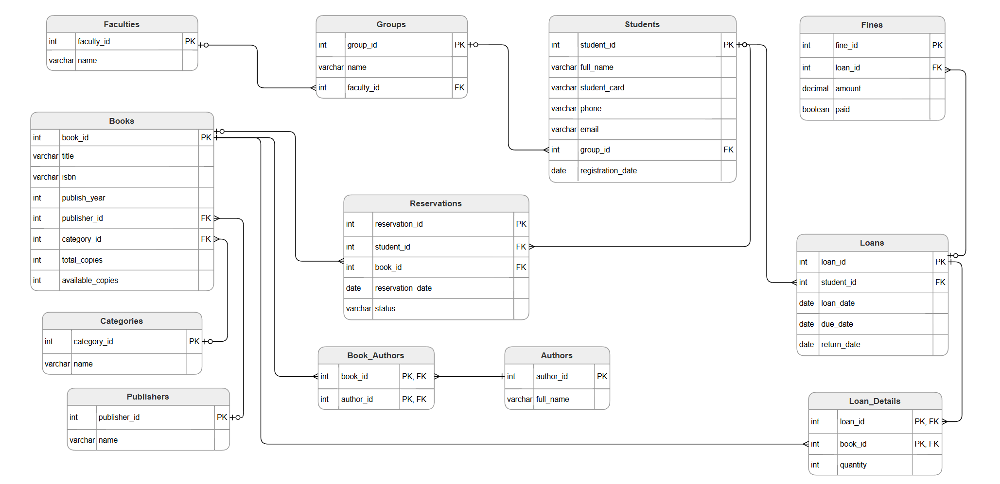

# Лабораторна робота №1

**Виконала:** ІО-45 Устілова Софія
**Тема:** Збір вимог та розробка схеми ER. Студентська бібліотека.  
**Мета:** Навчитись ідентифікувати сутності, атрибути та зв'язки з вимог. Створити концептуальну ER-діаграму, яка моделює вимоги до даних.

---

## ER-діаграма студентської бібліотеки

## 1. Вимоги до системи
*   Автоматизація обліку книжкового фонду навчального закладу.
*   Реєстрація читачів та контроль процесу видачі книг, повернення та нарахування штрафів.
*   Можливість відстежувати наявність копій книг та керувати бронюванням.
*   Контроль вчасного повернення літератури та перегляд інформації про штрафи.
*   Пошук книг за авторами або категоріями.

## 2. Дані, які зберігаються
*   **Інформація про книги**: назва, ISBN, рік видання, видавництво, категорія.
*   **Персональні дані студентів**: ПІБ та їх академічна приналежність.
*   **Історія транзакцій**: дані про видачі книг, деталі кожної книги в замовленні та бронювання.
*   **Фінансова звітність**: дані щодо нарахованих та сплачених штрафів.

## 3. Списки сутностей з їх атрибутами
*   **Faculties**: `faculty_id` (PK), `name`.
*   **Groups**: `group_id` (PK), `name`, `faculty_id` (FK).
*   **Students**: `student_id` (PK), `full_name`, `student_card`, `phone`, `email`, `group_id` (FK), `registration_date`.
*   **Books**: `book_id` (PK), `title`, `isbn`, `publish_year`, `publisher_id`, `category_id`, `total_copies`, `available_copies`.
*   **Authors**: `author_id` (PK), `full_name`.
*   **Book_Authors**: `book_id`, `author_id`.
*   **Publishers**: `publisher_id` (PK), `name`.
*   **Categories**: `category_id` (PK), `name`.
*   **Loans**: `loan_id` (PK), `student_id` (FK), `loan_date`, `due_date`, `return_date`.
*   **Loan_Details**: `loan_id`, `book_id`, `quantity`.
*   **Reservations**: `reservation_id` (PK), `student_id` (FK), `book_id` (FK), `reservation_date`, `status`.
*   **Fines**: `fine_id` (PK), `loan_id` (FK), `amount`, `paid`.

## 4. Пояснення зв’язків
*   **Faculties – Groups**: Один факультет містить багато груп, але кожна група належить лише одному факультету.
*   **Groups – Students**: В одній групі навчається багато студентів. Студент закріплений за однією групою.
*   **Students – Loans**: Один студент може мати багато записів про видачу книг протягом часу.
*   **Students – Reservations**: Студент може забронювати кілька книг.
*   **Loans – Loan_Details**: Одна операція видачі може містити кілька різних книг.
*   **Books – Loan_Details / Reservations**: Одна конкретна книга може фігурувати у багатьох записах про видачу або бронювання.
*   **Books – Authors**: Зв'язок через проміжну таблицю `Book_Authors`. Одна книга може мати кількох авторів, а один автор — багато книг.
*   **Categories/Publishers – Books**: Кожна книга належить до однієї категорії та має одного видавця.
*   **Loans – Fines**: Кожна видача може породити максимум один запис про штраф у разі несвоєчасного повернення.

## 5. Припущеня та обмеження
*   Кожен студент ідентифікується за унікальним номером `student_card`.
*   Позика вважається простроченою, якщо `return_date` порожній, а поточна дата перевищує `due_date`. Штраф нараховується автоматично наступного дня після дедлайну.
*   Бронювання книги діє протягом обмеженого часу, після чого статус змінюється на "Expired".
