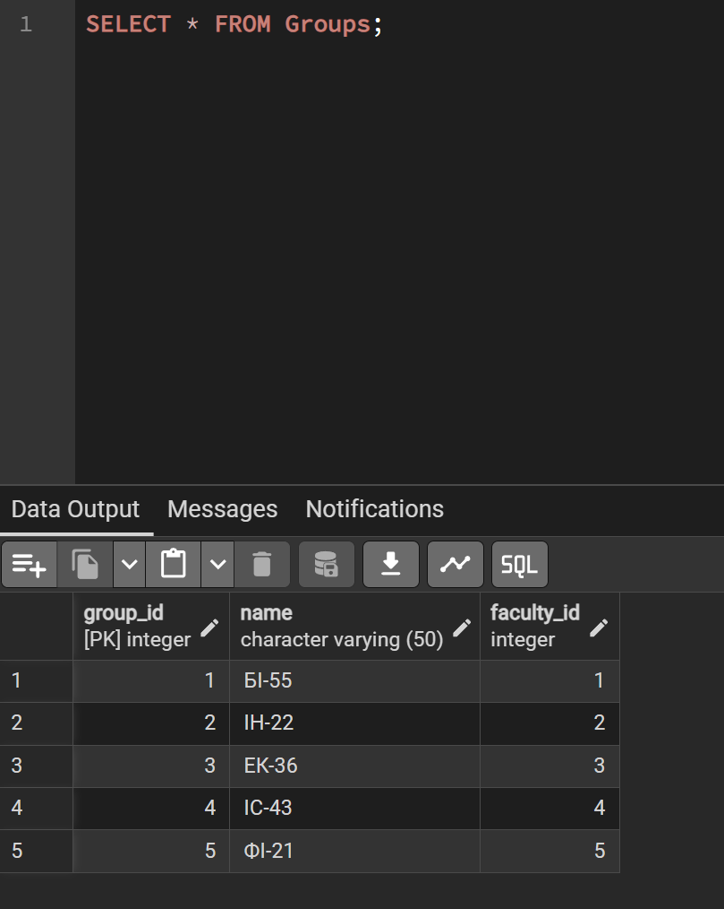
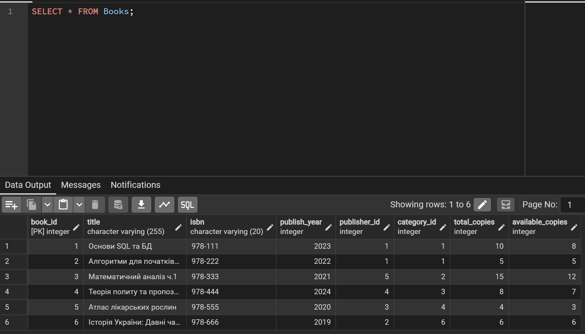

# Лабораторна робота №2

**Виконала:** ІО-45 Устілова Софія  
**Тема:** Перетворення ER-діаграми на схему PostgreSQL.  
**Мета:** Написати SQL DDL-інструкції для створення кожної таблиці з вашої ERD в PostgreSQL.

---

### SQL

```sql
CREATE TABLE Faculties (
    faculty_id SERIAL PRIMARY KEY,
    name VARCHAR(100) NOT NULL
);

CREATE TABLE Groups (
    group_id SERIAL PRIMARY KEY,
    name VARCHAR(50) NOT NULL,
    faculty_id INT,
    FOREIGN KEY (faculty_id) REFERENCES Faculties(faculty_id)
);

CREATE TABLE Students (
    student_id SERIAL PRIMARY KEY,
    full_name VARCHAR(100) NOT NULL,
    student_card VARCHAR(20) UNIQUE NOT NULL,
    phone VARCHAR(20),
    email VARCHAR(100),
    group_id INT,
    registration_date DATE,
    FOREIGN KEY (group_id) REFERENCES Groups(group_id)
);

CREATE TABLE Categories (
    category_id SERIAL PRIMARY KEY,
    name VARCHAR(100) NOT NULL
);

CREATE TABLE Publishers (
    publisher_id SERIAL PRIMARY KEY,
    name VARCHAR(100) NOT NULL
);

CREATE TABLE Books (
    book_id SERIAL PRIMARY KEY,
    title VARCHAR(255) NOT NULL,
    isbn VARCHAR(20) UNIQUE,
    publish_year INT,
    publisher_id INT,
    category_id INT,
    total_copies INT DEFAULT 1,
    available_copies INT DEFAULT 1,
    FOREIGN KEY (publisher_id) REFERENCES Publishers(publisher_id),
    FOREIGN KEY (category_id) REFERENCES Categories(category_id)
);

CREATE TABLE Authors (
    author_id SERIAL PRIMARY KEY,
    full_name VARCHAR(100) NOT NULL
);

CREATE TABLE Book_Authors (
    book_id INT,
    author_id INT,
    PRIMARY KEY (book_id, author_id),
    FOREIGN KEY (book_id) REFERENCES Books(book_id),
    FOREIGN KEY (author_id) REFERENCES Authors(author_id)
);

CREATE TABLE Loans (
    loan_id SERIAL PRIMARY KEY,
    student_id INT,
    loan_date DATE NOT NULL,
    due_date DATE NOT NULL,
    return_date DATE,
    FOREIGN KEY (student_id) REFERENCES Students(student_id)
);

CREATE TABLE Loan_Details (
    loan_id INT,
    book_id INT,
    quantity INT DEFAULT 1,
    PRIMARY KEY (loan_id, book_id),
    FOREIGN KEY (loan_id) REFERENCES Loans(loan_id),
    FOREIGN KEY (book_id) REFERENCES Books(book_id)
);

CREATE TABLE Fines (
    fine_id SERIAL PRIMARY KEY,
    loan_id INT,
    amount NUMERIC(10,2),
    paid BOOLEAN DEFAULT FALSE,
    FOREIGN KEY (loan_id) REFERENCES Loans(loan_id)
);

INSERT INTO Faculties (name) VALUES
('Біології'),
('Інформатики'),
('Економіки'),
('Історії'),
('Філософії');

INSERT INTO Groups (name, faculty_id) VALUES
('БІ-55', 1),
('ІН-22', 2),
('ЕК-36', 3),
('ІС-43', 4),
('ФІ-21', 5);

INSERT INTO Students (full_name, student_card, phone, email, group_id, registration_date) VALUES
('Іван Петренко', 'ST001', '+380501111111', 'ivan@gmail.com', 1, '2024-09-01'),
('Марія Коваль', 'ST002', '+380502222222', 'maria@gmail.com', 1, '2024-09-02'),
('Олег Шевченко', 'ST003', '+380503333333', 'oleg@gmail.com', 2, '2024-09-03'),
('Анна Бондар', 'ST004', '+380504444444', 'anna@gmail.com', 3, '2024-09-04');

INSERT INTO Categories (name) VALUES
('Програмування'),
('Математика'),
('Економіка'),
('Медицина'),
('Філософія'),
('Історія');

INSERT INTO Publishers (name) VALUES
('КПІ'),
('Століття'),
('Природа'),
('Економічні Науки'),
('Функція'),
('Думка');

INSERT INTO Authors (full_name) VALUES
('Олексій Програмістченко'), 
('Марія Обчислювальна'), 
('Ігор Ринковий'), 
('Світлана Трав’яна'), 
('Василь Стародавній');

INSERT INTO Books (title, isbn, publish_year, publisher_id, category_id, total_copies, available_copies) VALUES
('Основи SQL та БД', '978-111', 2023, 1, 1, 10, 8),
('Алгоритми для початківців', '978-222', 2022, 1, 1, 5, 5),
('Математичний аналіз ч.1', '978-333', 2021, 5, 2, 15, 12),
('Теорія попиту та пропозиції', '978-444', 2024, 4, 3, 8, 7),
('Атлас лікарських рослин', '978-555', 2020, 3, 4, 4, 3),
('Історія України: Давні часи', '978-666', 2019, 2, 6, 6, 6);

INSERT INTO Book_Authors (book_id, author_id) VALUES
(1, 1), 
(2, 1), 
(3, 2), 
(4, 3), 
(5, 4), 
(6, 5);

INSERT INTO Loans (student_id, loan_date, due_date, return_date) VALUES
(1, '2025-03-01', '2025-03-15', NULL),
(2, '2025-03-02', '2025-03-16', '2025-03-10'),
(3, '2025-03-05', '2025-03-20', NULL);

INSERT INTO Loan_Details (loan_id, book_id, quantity) VALUES
(1, 1, 1),
(1, 3, 1),
(2, 2, 1),
(3, 4, 1);

INSERT INTO Fines (loan_id, amount, paid) VALUES
(1, 50.00, FALSE),
(3, 30.00, FALSE),
(2, 0.00, TRUE);
```

---

### Опис таблиць:

* **Faculties** – перелік факультетів університету. PK `faculty_id` для ідентифікації кожного факультету;
* **Groups** – академічні групи студентів. PK `group_id` і містить FK `faculty_id`, що пов’язує групу з факультетом;
* **Students** – дані про зареєстрованих студентів. PK `student_id` і містить FK `group_id`, що визначає приналежність студента до групи. Поле `student_card` має бути унікальним;
* **Books** – книги в бібліотеці. Містить PK `book_id`. Пов’язана через FK з видавництвами (`publisher_id`) та категоріями (`category_id`);
* **Book_Authors** – автори книг (автори та їх книги). Містить PK з `book_id` та `author_id` також є FK, щоб пов’язати книги з авторами;
* **Authors** – автори книг. Містить PK `author_id`;
* **Categories** – категорії книг. Містить PK `category_id`;
* **Publishers** – книжкові видавництва. Містить PK `publisher_id`;
* **Reservations** – черга бронювання книг. Містить PK `reservation_id` та два FK `student_id` та `book_id`, щоб знати, хто саме та яку книгу забронював; 
* **Loans** – інформація про видачу книг студенттам. PK `loan_id` та пов’язує її зі студентом через FK `student_id`;
* **Loan_Details** – деталі видачі книг. Містить PK з `loan_id` та `book_id` (обидва FK), що дозволяє фіксувати список книг у одній видачі;
* **Fines** – штрафи за несвоєчасне повернення книг. PK `fine_id` та FK `loan_id`, який вказує, за яку саме видачу нараховано штраф.

---

### Тестовий запит 1
SELECT * FROM Groups;



### Тестовий запит 2
SELECT * FROM Books;


