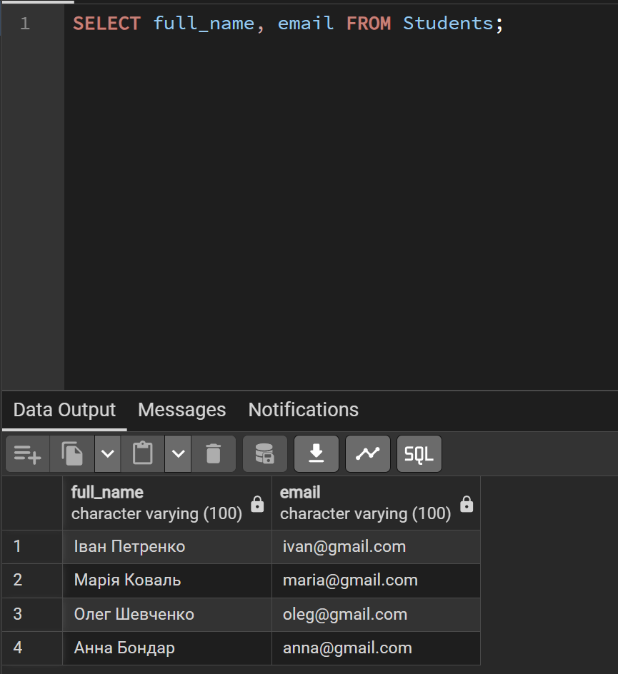
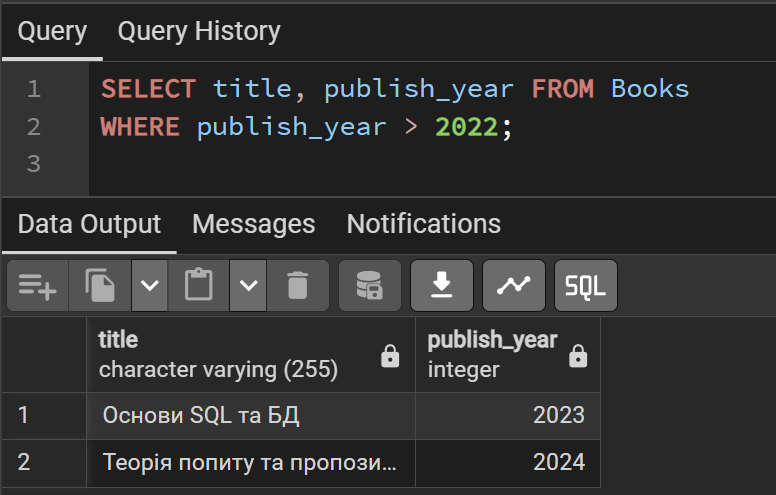
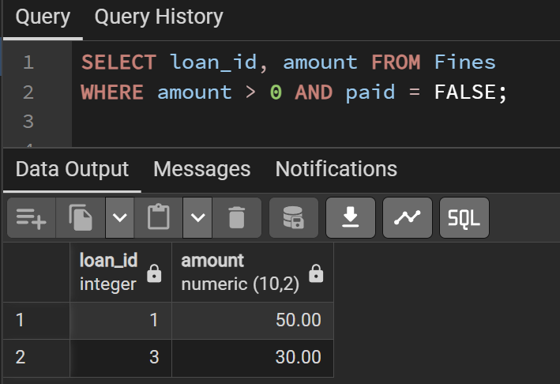
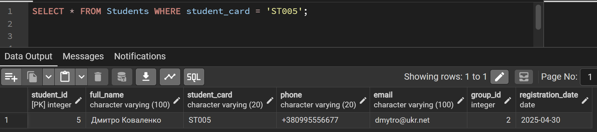
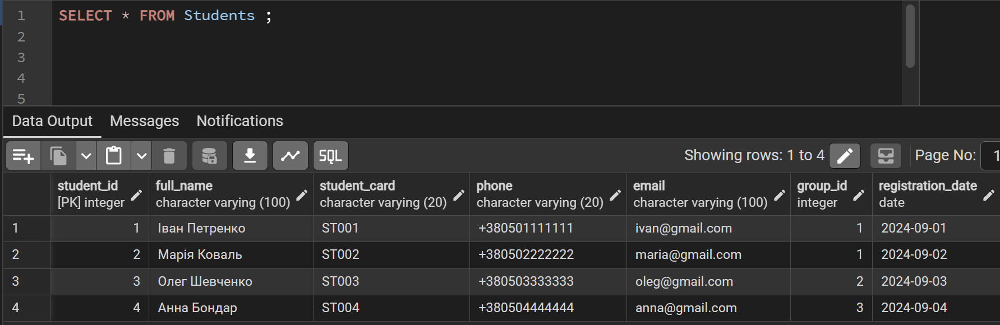

# Лабораторна робота №3

**Виконала:** ІО-45 Устілова Софія  
**Тема:** Маніпулювання даними SQL (OLTP). 
**Мета:** Написати запити SELECT для отримання даних. Використання операторів INSERT, UPDATE, DELETE.

---

### 1. Оператор SELECT

```sql
-- Імена студентів та їхні електронні адреси
SELECT full_name, email FROM Students;
```


```sql 
-- Знайти всі книги, видані після 2022 року
SELECT title, publish_year FROM Books 
WHERE publish_year > 2022;
```


```sql 
-- Знайти список боргів: ID позики та суму штрафу, де сума більше 0
SELECT loan_id, amount FROM Fines 
WHERE amount > 0 AND paid = FALSE;
```


---

### 2. Оператор INSERT
```sql 
-- Реєстрація нового студента в групу ІН-22
INSERT INTO Students (full_name, student_card, phone, email, group_id, registration_date)
VALUES ('Дмитро Коваленко', 'ST005', '+380995556677', 'dmytro@ukr.net', 2, '2025-04-30');
```

```sql 
-- Додавання нової книги
INSERT INTO Books (title, isbn, publish_year, publisher_id, category_id, total_copies, available_copies)
VALUES ('Алгоритми для початківців 2', '978-777', 2024, 1, 1, 3, 3);
```

```sql 
-- Перевірка реєстрація нового студента
SELECT * FROM Students WHERE student_card = 'ST005';
```


---

### 3. Оператор UPDATE
```sql 
-- Зміна номеру телефону студента за його номером картки
UPDATE Students 
SET phone = '+380670000000' 
WHERE student_card = 'ST005';
```

```sql 
-- Коли студент повертає книгу, збільшується кількість доступних копій
UPDATE Books 
SET available_copies = available_copies + 1 
WHERE book_id = 1;
```

```sql 
-- Позначити штраф як оплачений
UPDATE Fines 
SET paid = TRUE 
WHERE fine_id = 1;
```

---

### 4. Оператор DELETE
```sql
-- Видалення конкретного штрафу (наприклад, якщо він був нарахований помилково)
DELETE FROM Fines 
WHERE fine_id = 2;
```

```sql
-- Видалення студента за ID
DELETE FROM Students 
WHERE student_id = 5;
```

```sql
-- Перевірка видалення
SELECT * FROM Students;
```

