# Лабораторна робота №4

**Виконала:** ІО-45 Устілова Софія  
**Тема:** Аналітичні SQL-запити (OLAP).
**Мета:** Використати агрегатні функції, такі як COUNT, SUM, AVG, MIN та MAX. Написати запити GROUP BY для групування рядків за одним або кількома стовпцями. Використати HAVING для фільтрації результатів згрупованих запитів. Виконувати операції JOIN. Створювати об'єднані запити на агрегацію для кількох таблиць.

---

### 1. Агрегатні функці

```sql
-- Кількість студентів
SELECT COUNT(*) AS total_students
FROM Students;
```
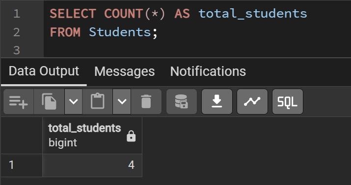
 
```sql
-- Сумарна кількість всіх книг
SELECT SUM(total_copies) AS total_copies
FROM Books;
```
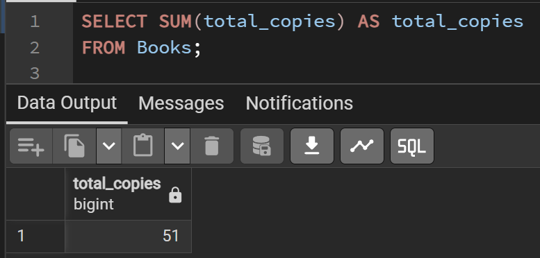
 
 
```sql 
-- Найпізніша дата реєстрації студента
SELECT MAX(registration_date) AS last_registered_student
FROM Students;
```
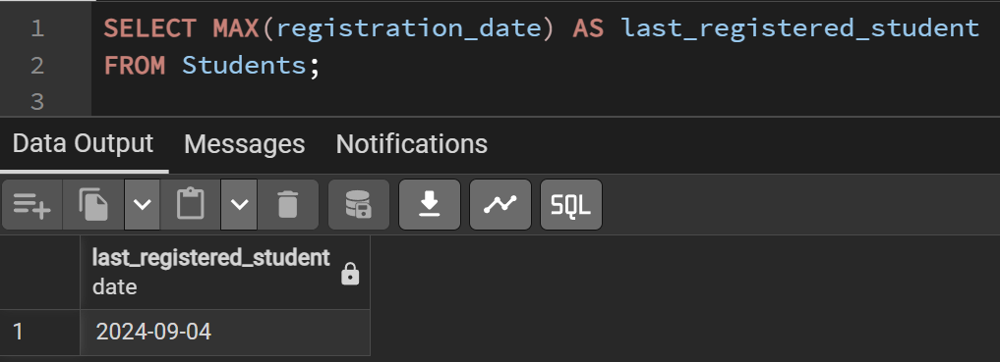
 

```sql 
-- Мінімальний штраф
SELECT MIN(amount) AS min_fine
FROM Fines;
```
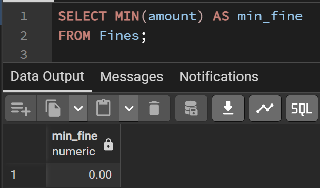
 

---

### 2. Запити GROUP BY

```sql
-- Кількість студентів у кожній групі
SELECT group_id, COUNT(*) AS student_count
FROM Students
GROUP BY group_id;
```
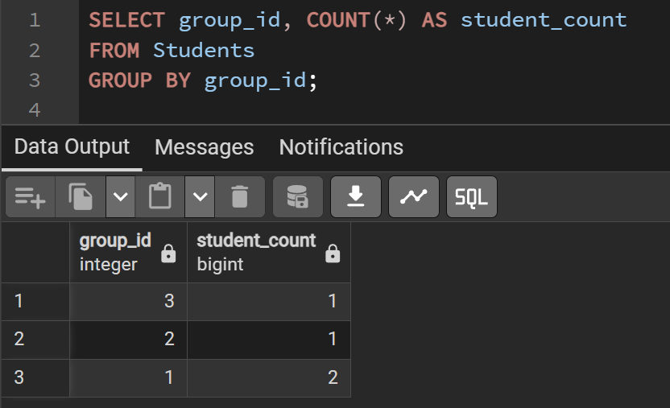
 

```sql 
-- Кількість виданих книг по кожному замовленню
SELECT loan_id, SUM(quantity) AS total_books
FROM Loan_Details
GROUP BY loan_id;
```
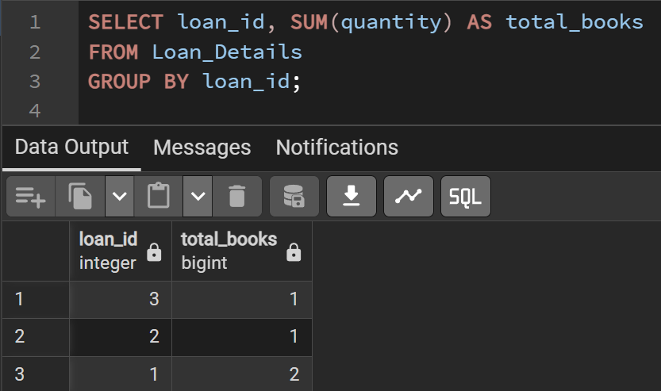

---

### 3. HAVING для фільтрації 

```sql
-- Замовлення зі штрафом більше 20
SELECT loan_id, SUM(amount) AS total_fine
FROM Fines
GROUP BY loan_id
HAVING SUM(amount) > 20;
```
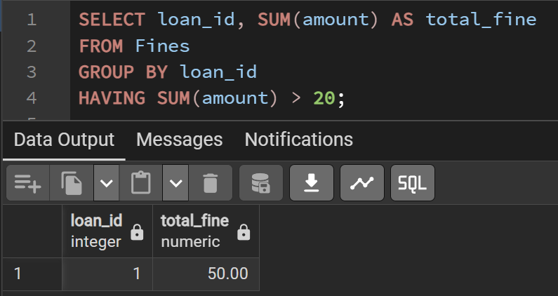 

```sql
-- Автори, у яких більше 1 книги
SELECT author_id, COUNT(book_id) AS books_written
FROM Book_Authors
GROUP BY author_id
HAVING COUNT(book_id) > 1;
```
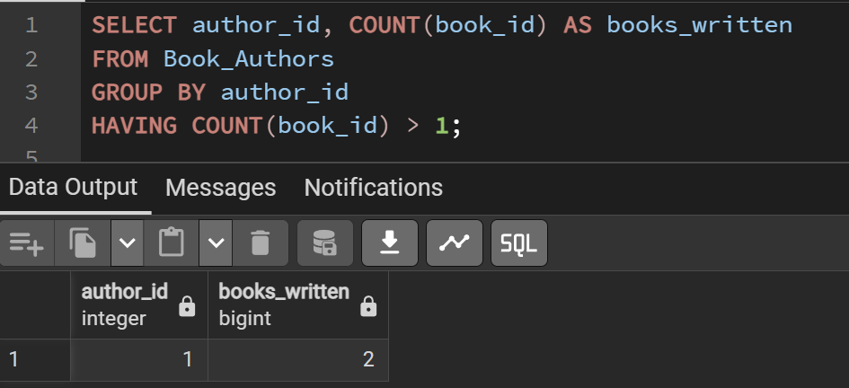

```sql 
-- Групи, де більше 1 студента
SELECT group_id, COUNT(*) AS student_count
FROM Students
GROUP BY group_id
HAVING COUNT(*) > 1;
```
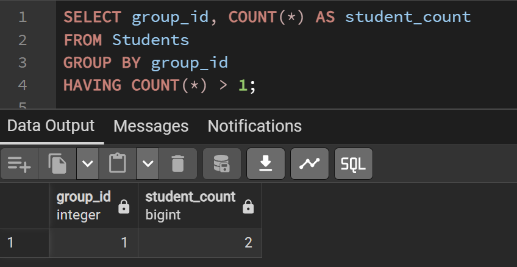

---

### 4. Операції JOIN

```sql
-- Студенти та їх групи (INNER JOIN)
SELECT s.full_name, g.name AS group_name
FROM Students s
INNER JOIN Groups g ON s.group_id = g.group_id;
```
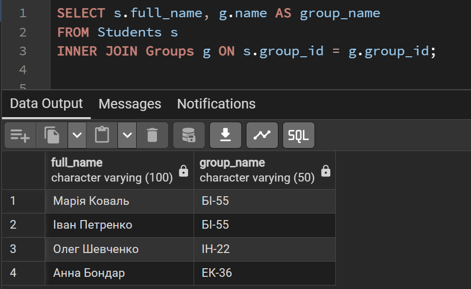

```sql 
-- Книги та їх категорії (INNER JOIN)
SELECT b.title, c.name AS category
FROM Books b
INNER JOIN Categories c ON b.category_id = c.category_id;
```
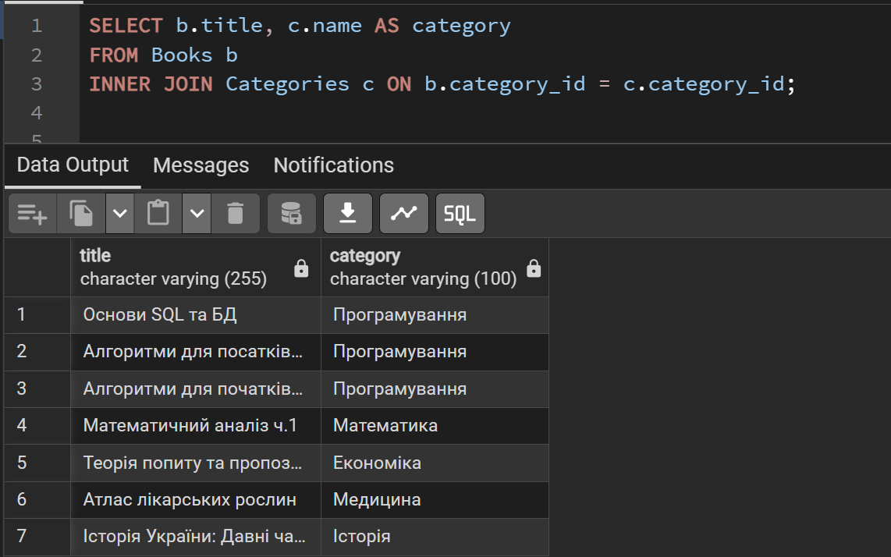 

```sql
-- Всі студенти та їх видачі (LEFT JOIN)
SELECT s.full_name, l.loan_id
FROM Students s
LEFT JOIN Loans l ON s.student_id = l.student_id;
```
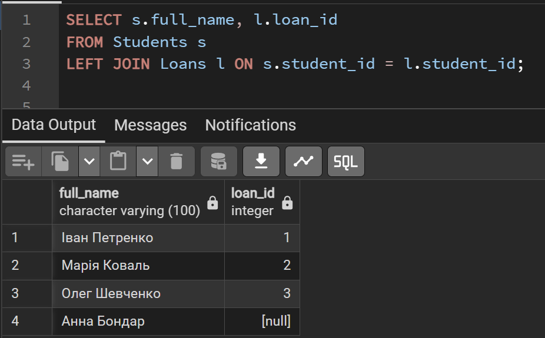
 
---

### 5. Багатотаблична агрегація

```sql
-- Кількість студентів у кожній групі
SELECT g.name AS group_name, COUNT(s.student_id) AS student_count
FROM Groups g
JOIN Students s ON g.group_id = s.group_id
GROUP BY g.name;
```
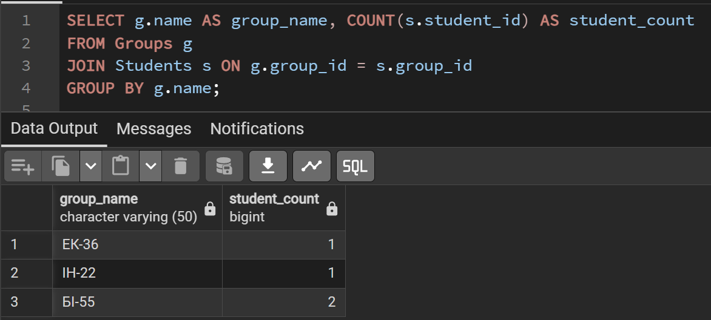

```sql 
-- Кількість виданих книг кожному студенту
SELECT s.full_name, SUM(ld.quantity) AS total_books_taken
FROM Students s
JOIN Loans l ON s.student_id = l.student_id
JOIN Loan_Details ld ON l.loan_id = ld.loan_id
GROUP BY s.full_name;
```
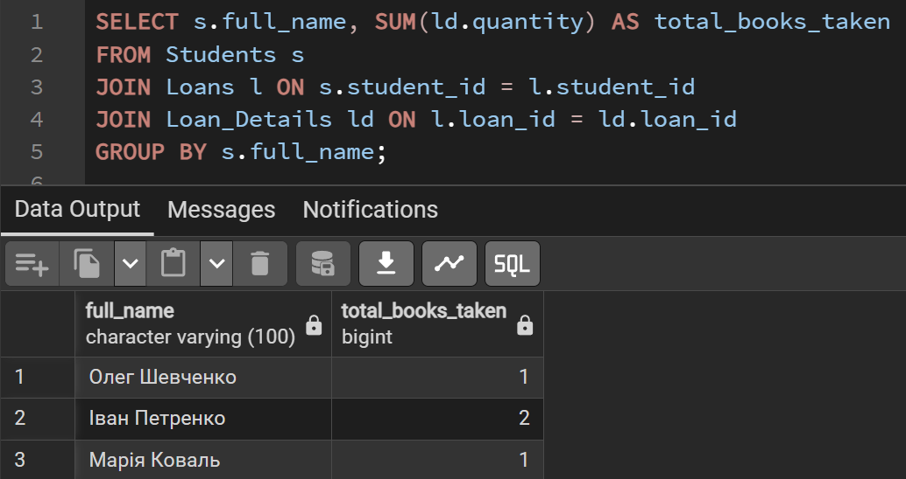 

```sql
-- Кількість книг у кожній категорії
SELECT c.name AS category, COUNT(b.book_id) AS books_count
FROM Categories c
JOIN Books b ON c.category_id = b.category_id
GROUP BY c.name;
```
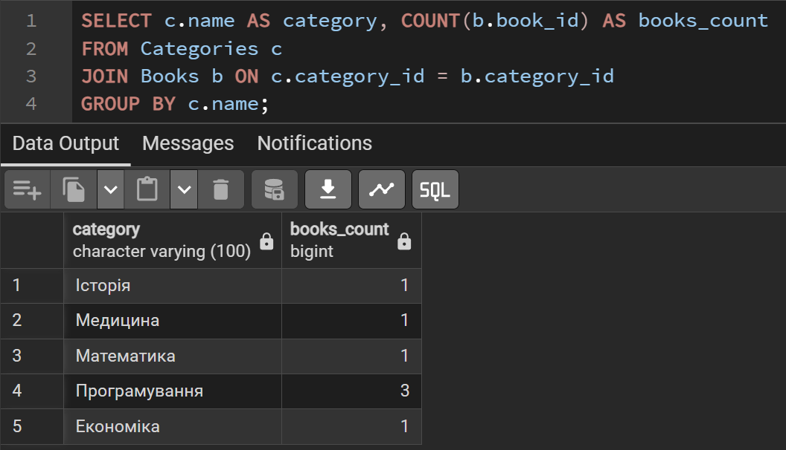
