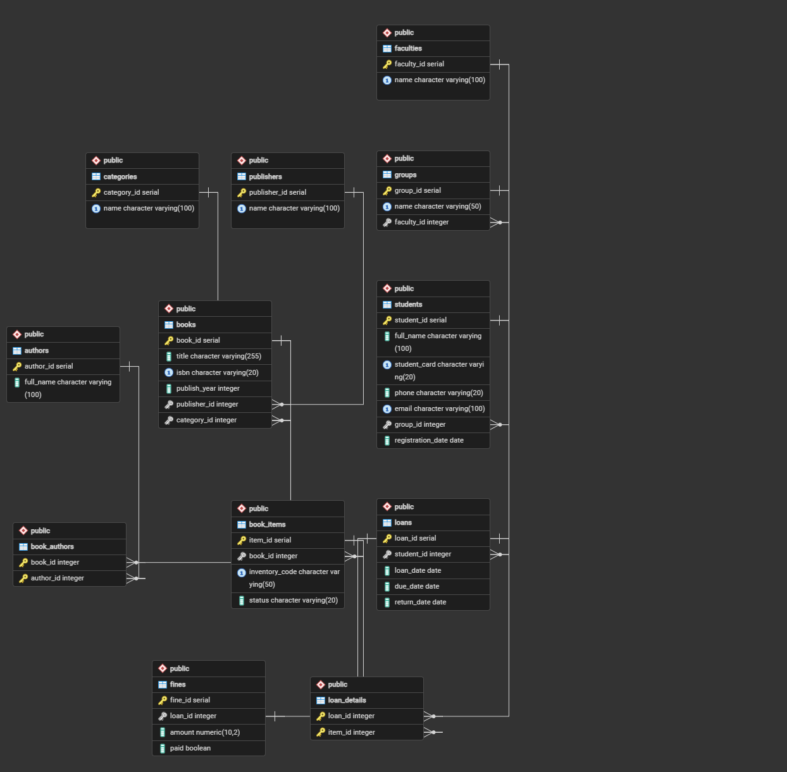

# Лабораторна робота №5

**Виконала:** ІО-45 Устілова Софія  
**Тема:** Нормалізація бази даних.  
**Мета:** Проаналізуєте та вдосконалите схему бази даних, яку створили в попередніх лабораторних роботах.

---

# 1. Аналіз початкової схеми

* **Faculties** – перелік факультетів. PK `faculty_id`;
* **Groups** – академічні групи студентів. PK `group_id`;
* **Students** – дані про зареєстрованих студентів. PK `student_id` і містить FK `group_id`;
* **Books** – книги в бібліотеці. Містить PK `book_id`. Пов’язана через FK з видавництвами (`publisher_id`) та категоріями (`category_id`);
* **Book_Authors** – автори книг. Містить PK з `book_id` та `author_id` також є FK;
* **Authors** – автори книг. Містить PK `author_id`;
* **Categories** – категорії книг. Містить PK `category_id`;
* **Publishers** – книжкові видавництва. Містить PK `publisher_id`;
* **Reservations** – черга бронювання книг. Містить PK `reservation_id` та два FK `student_id` та `book_id`; 
* **Loans** – інформація про видачу книг студенттам. PK `loan_id` та пов’язує її зі студентом через FK `student_id`;
* **Loan_Details** – деталі видачі книг. Містить PK з `loan_id` та `book_id` (обидва FK);
* **Fines** – штрафи за несвоєчасне повернення книг. PK `fine_id` та FK `loan_id`.

---

# Функціональні залежності початкової схеми
1. Students: `student_id` → `full_name`, `student_card`, `phone`, `email`, `group_id`.

2. Books: `book_id` → `title`, `isbn`, `publish_year`, `publisher_id`, `category_id`, `total_copies`, `available_copies`.

3. Loan_Details: (`loan_id`, `book_id`) → `quantity`.

---

### Початкова ER-діаграма



---

# Перевірка нормальних форм

1. 1NF: схема відповідає 1NF. Всі атрибути є атомарними, а повторювані групи відсутні.

2. 2NF: Схема відповідає 2NF. У таблицях зі складеними ключами, ключові атрибути залежать від усього ключа, а не від його частини.

3. 3NF: Схема не відповідає 3NF. У таблиці Books присутні поля total_copies та available_copies. Це створює транзитивну залежність, оскільки кількість доступних книг залежить від стану фізичних примірників та фактів їх видачі, а не від атрибутів самої назви книги (ISBN чи назви).

---

# Процес нормалізації до 3NF

Для нормалізації змінила таблицю Books. Видалила обчислювані поля total_copies та available_copies з основної таблиці Books. Створила нову таблицю Book_Items для обліку кожного фізичного примірника книги окремо. Це дозволить уникнути надлишковості. Оновила таблицю Loan_Details. Замість book_id тепер item_id, що пов'язує видачу з конкретним примірником.

---

### Оновлена ER-діаграма


---

# SQL DDL-скрипти для фінальних таблиць

```sql
-- Створення таблиці примірників для усунення проблем у Books
CREATE TABLE Book_Items (
    item_id SERIAL PRIMARY KEY,
    book_id INT NOT NULL,
    inventory_code VARCHAR(50) UNIQUE NOT NULL,
    status VARCHAR(20) DEFAULT 'available',
    FOREIGN KEY (book_id) REFERENCES Books(book_id)
);

-- Оновлена таблиця Loan_Details
CREATE TABLE Loan_Details (
    loan_id INT,
    item_id INT,
    PRIMARY KEY (loan_id, item_id),
    FOREIGN KEY (loan_id) REFERENCES Loans(loan_id),
    FOREIGN KEY (item_id) REFERENCES Book_Items(item_id)
);
