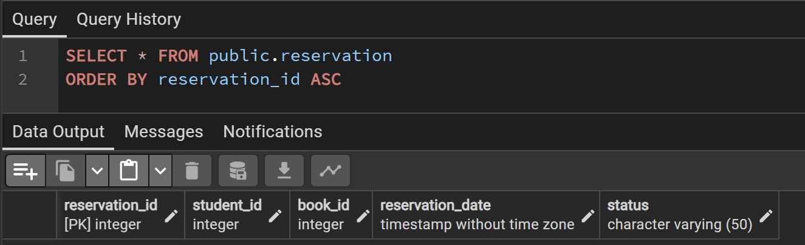
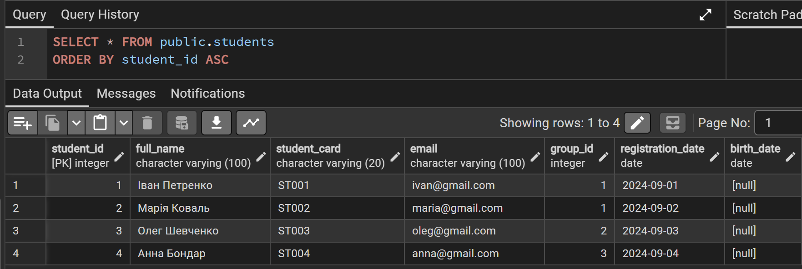
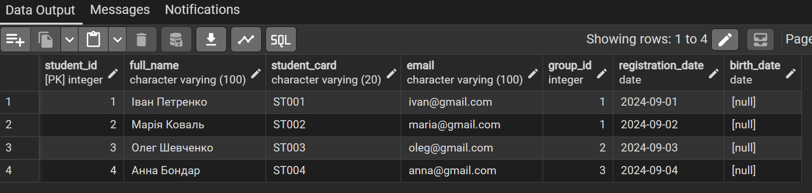
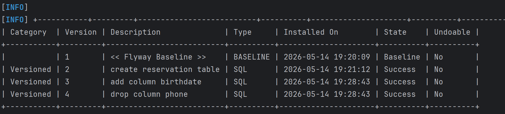
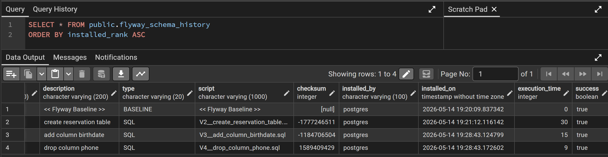

# Лабораторна робота №6

* **Виконала:** ІО-45 Устілова Софія  
* **Тема:** Міграції схем за допомогою Flyway.
* **Мета:** Використати Flyway для керування схемами та дослідити, як Flyway може аналізувати та змінювати схему вашої бази даних.

---

## 1. Міграція V1. Додавання нової таблиці
* **Файл:** `V2__create_reservation_table.sqll`
* **Опис дій:** Створено нову таблицю `Reservation` для можливості зарезервувати книгу.

```sql
CREATE TABLE Reservation (
    reservation_id SERIAL PRIMARY KEY,
    student_id INT NOT NULL,
    book_id INT NOT NULL,
    reservation_date TIMESTAMP DEFAULT CURRENT_TIMESTAMP,
    status VARCHAR(50) DEFAULT 'active',

    CONSTRAINT fk_reservation_student
        FOREIGN KEY (student_id)
        REFERENCES students(student_id)
        ON DELETE CASCADE,

    CONSTRAINT fk_reservation_book
        FOREIGN KEY (book_id)
        REFERENCES books(book_id)
        ON DELETE CASCADE,

    CONSTRAINT uq_student_book
        UNIQUE(student_id, book_id)
);
```

# Результат міграції 1



---

## 2. Міграція V2. Додавання нової колонки.
* **Файл:** `V3__add_column_birthdate.sql`
* **Опис дій:** Додано колонкку `birth_date` до таблиці `students`.

```sql
ALTER TABLE students
ADD COLUMN birth_date DATE;
```

# Результат міграції 2



## 3. Міграція V3. Додавання нової таблиці
* **Файл:** `V4__drop_column_phone.sql`
* **Опис дій:** Видалено колонку `phone` в таблиці `students`

```sql
ALTER TABLE students
DROP COLUMN phone;
```

# Результат міграції 3



---

## Результат перевірки статусу застосованих міграцій Flyway.



## Вміст системної таблиці flyway_schema_history бази даних


