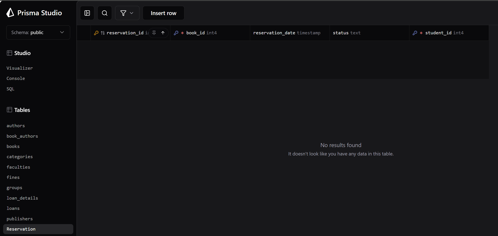
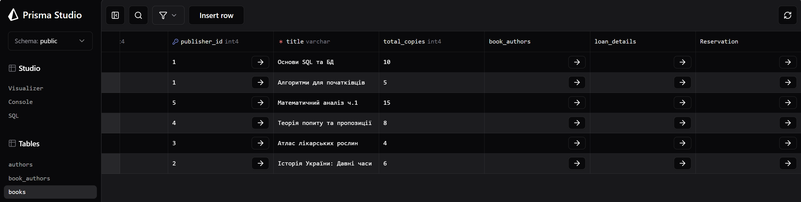
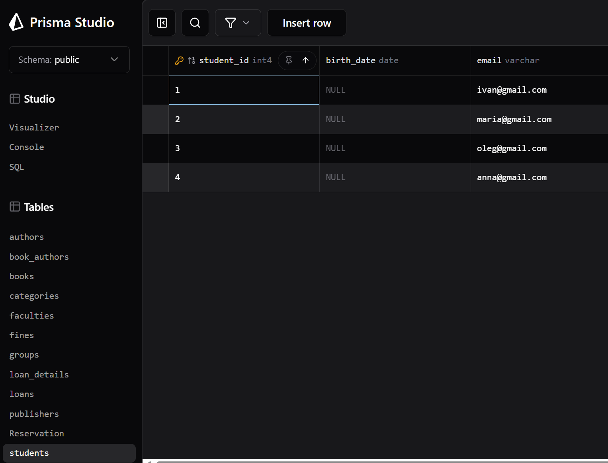
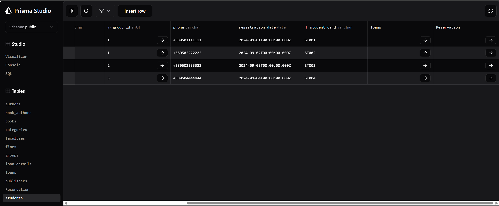
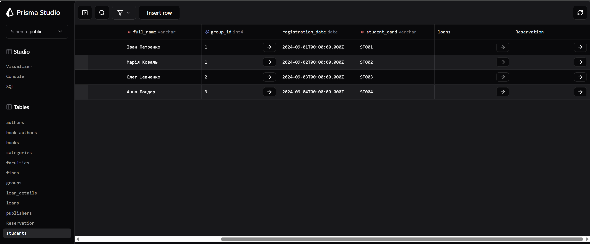

# Лабораторна робота №6

**Виконала:** ІО-45 Устілова Софія  
**Тема:** Міграції схем за допомогою Prisma ORM.
**Мета:** Використати Prisma ORM для керування схемами та дослідити, як Prisma може аналізувати та змінювати схему вашої бази даних.

---

## 1. Міграція №1. Додавання нової таблиці. 

**До:**
(Таблиця `Reservation` відсутня)


**Після:**
(Додано таблицю `Reservation` і колонку `Reservation` до таблиці `books` та `students` )

```prisma
model Reservation {
  reservation_id   Int      @id @default(autoincrement())
  student_id       Int
  book_id          Int
  reservation_date DateTime @default(now())
  status           String   @default("active")
  students students @relation(fields: [student_id], references: [student_id])
  books    books   @relation(fields: [book_id], references: [book_id])

  @@unique([student_id, book_id])
}
```

# Результат міграції 1



# Результат міграції 1_2



# Результат міграції 1_3


---

## 2. Міграція №2. Додавання нової колонки `birth_date` до таблиці `students`.

**До:**
(Колонка `birth_date` в таблиці `students` відсутня)


**Після:**
(Додано колонку `birth_date` в таблицю `students`)


```prisma
model students {
  student_id        Int       @id @default(autoincrement())
  full_name         String    @db.VarChar(100)
  student_card      String    @unique @db.VarChar(20)
  phone             String?   @db.VarChar(20)
  email             String?   @db.VarChar(100)
  group_id          Int?
  registration_date DateTime? @db.Date
  birth_date        DateTime? @db.Date
  loans             loans[]
  groups            groups?   @relation(fields: [group_id], references: [group_id], onDelete: NoAction, onUpdate: NoAction)
  reservations      Reservation[]
}
```

# Результат міграції 2



---

## 3. Міграція №3. Видалення колонки `phone` з таблиці `students`.

**До:**
(Колонка `phone` в таблиці `students` присутня)

# Результат до міграції 3




**Після:**
(Видалено колонку `phone` в таблиці `students`)

```prisma
model students {
  student_id        Int       @id @default(autoincrement())
  full_name         String    @db.VarChar(100)
  student_card      String    @unique @db.VarChar(20)
  email             String?   @db.VarChar(100)
  group_id          Int?
  registration_date DateTime? @db.Date
  birth_date        DateTime? @db.Date
  loans             loans[]
  groups            groups?   @relation(fields: [group_id], references: [group_id], onDelete: NoAction, onUpdate: NoAction)
  reservations      Reservation[]
}
```

# Результат міграції 3


